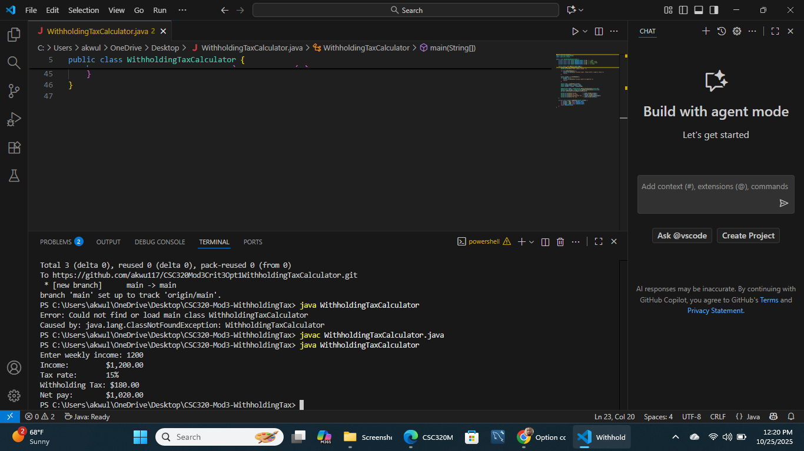

# CSC320 Module 3 Critical Thinking Option 1: Withholding Tax Calculator

This Java program calculates the withholding tax and net pay for an entered weekly income.  
It determines the correct tax rate based on income brackets, then displays:
- Income
- Tax Rate
- Withholding Tax
- Net Pay

## How to Run
1. Open the project in Visual Studio Code.
2. Compile the file using:
   ```bash
   javac WithholdingTaxCalculator.java

